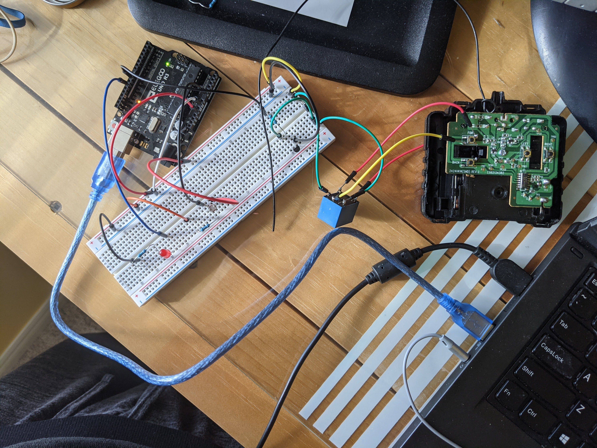

# AutomaticBlinds
A personal project that utilizes and old RC toy car to automatically open blinds in the morning. This request was made by a friend who always needed to close the blinds at night to block out the streetlights, but would always wake up in darkness as opposed to natural light. While I will not be using it in my daily life, I was able to learn many new things using and Arduino Uno, 5V relay, and photocell.

Parts Used:
- Arduino Uno
- 1k ohm resistor
- 2k ohm resistor
- RC toy car + remote
- Photocell
- SRD-05VDC-SL-C relay
- PN2222 transistor
- Diode Rectifier
- Jumper wires
- Soldering iron
- Hotglue, cardboard, elastic band (used to make gears needed to open the blinds using the car motor)

General Concept:
1. Photocell used to detect when it's bright outside
2. Once a certain brightness is reached, set the transitor pin to HIGH
3. Transistor triggers the relay, changing the switch position
4. Relay is connected on either side of the button on the remote responsible for forwards movement
5. Triggering the relay bybasses the orignal button on the remote by creating a short circuit
6. Motor begins to move and opens the blinds

Demo Video:

]

General Eletronics:

Remote Wiring:

Cardboard Gears:

RC motor setup:

